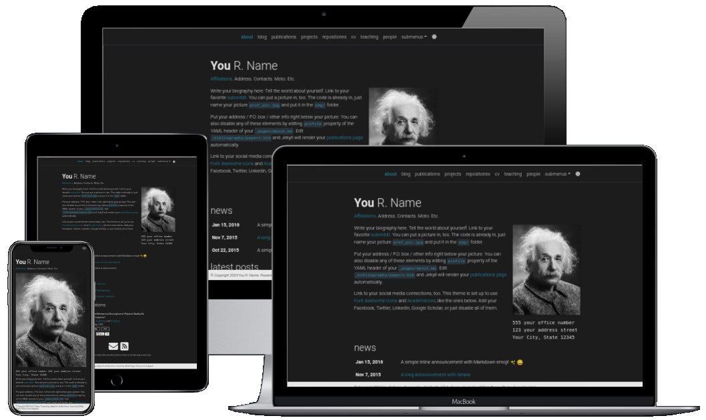

# al-folio

<div align="center">

[](https://alshedivat.github.io/al-folio/)

**A simple, clean, and responsive [Jekyll](https://jekyllrb.com/) theme for academics.**

</div>

This is Varshini Elangovan's personal website ([varshini-e.github.io](https://varshini-e.github.io)), built on the [al-folio](https://github.com/alshedivat/al-folio) Jekyll theme. For setup and customization docs for the theme itself, see the [upstream al-folio repository](https://github.com/alshedivat/al-folio) and its [documentation](https://github.com/alshedivat/al-folio#documentation).

## Local development

```bash
docker compose pull && docker compose up
# Site runs at http://localhost:8080
```

See [AGENTS.md](AGENTS.md) for the full local dev and pre-commit workflow.

## Light/Dark Mode

This template has a built-in light/dark mode. It detects the user's preferred color scheme and can also be switched manually via the sun/moon icon in the top right corner of the page.

<p align="center">


</p>

## License

The theme is available as open source under the terms of the [MIT License](https://github.com/alshedivat/al-folio/blob/main/LICENSE).

**al-folio** is created and maintained by [Maruan Al-Shedivat](https://maruan.alshedivat.com) and contributors — full credit and the original repository is at [alshedivat/al-folio](https://github.com/alshedivat/al-folio). Originally, al-folio was based on the [\*folio theme](https://github.com/bogoli/-folio) published by [Lia Bogoev](https://liabogoev.com), also under the MIT license.
